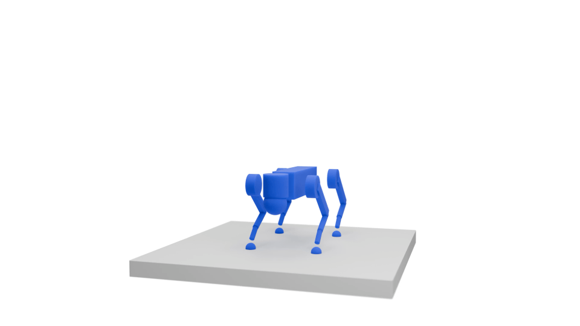

# Visualizations

All robot renders on our [project page](https://transformer-transformer.github.io) come out of the same pipeline.
A script dumps MuJoCo physics states into a pickle, Blender imports the pickle into a template scene and renders each frame as a PNG, then ffmpeg stitches the PNGs into an mp4.
There are two producers of these pickles: [robot rollouts](#robot-rollouts) from Zarr datasets, and [RoboToken diffusion processes](#diffusion-processes) from a Transformer Transformer hardware generation checkpoint.

## Rendering Setup

Download the Blender template scenes into the repo root

```sh
wget -qO- https://real.stanford.edu/transformer-transformer/blender_templates.zip | bsdtar -xvf- -C ./
```

This unpacks to `blender_templates/`, one pre-configured scene per design space

| Template                                        | Design space                                    |
| ----------------------------------------------- | ----------------------------------------------- |
| `blender_templates/vis_template_quadruped.blend`              | Quadruped manipulator (`umi_on_legs_plus_plus`) |
| `blender_templates/vis_template_wheeled_bimanual.blend` | Wheeled bimanual (`wheeled_bimanual`)           |
| `blender_templates/vis_template_viperx.blend`       | ViperX                                          |

Each template contains a camera, lighting matched to the robot's scale, default resolution and sample counts, and a hidden `hidden_axes` object that gets duplicated to animate target poses and tracked links.

Beyond the python environment, rendering needs:

- **Blender >= 4.0**, with the `blender` executable on your `PATH` (or pass `--blender /path/to/blender`).
- **A GPU is strongly recommended.** The render script picks the best Cycles backend your Blender build supports (OptiX → CUDA → HIP → oneAPI → Metal) and enables GPU denoising; with no usable GPU it falls back to CPU rendering, which is much slower.
- **ffmpeg** with libx264, for encoding PNGs into mp4s.

### Physics State Pickles

Every pickle the renderer consumes is a **list of dicts**, one per animation frame, with these keys

| Key                   | Type                                   | Description                                                            |
| --------------------- | -------------------------------------- | ---------------------------------------------------------------------- |
| `link/geom_type`      | `list[int]`                            | MuJoCo geometry type per geom (sphere=2, capsule=3, cylinder=5, box=6) |
| `link/geom_size`      | `list[tuple[float,float,float]]`       | Per-geom size parameters                                               |
| `link/rgba`           | `list[tuple[float,float,float,float]]` | Per-geom RGBA color                                                    |
| `link/pos`            | `list[tuple[float,float,float]]`       | Per-geom world position                                                |
| `link/quat_wxyz`      | `list[tuple[float,float,float,float]]` | Per-geom orientation quaternion (w,x,y,z)                              |
| `target_pose/pos`     | `list[tuple[float,float,float]]`       | (optional) Target pose positions                                       |
| `target_pose/quat`    | `list[tuple[float,float,float,float]]` | (optional) Target pose orientations                                    |
| `track_link_obs/pos`  | `list[tuple[float,float,float]]`       | (optional) Tracked link positions                                      |
| `track_link_obs/quat` | `list[tuple[float,float,float,float]]` | (optional) Tracked link orientations                                   |

These pickles are produced by `scripts/visualize_dataset.py` (via `pickle_output_root`) and by `scripts/visualize_robotoken_diffusion.py`.
Because frames carry their own geometry, robots can change shape mid-animation — that is what makes the diffusion visualizations possible.

## Robot Rollouts

The rollout pipeline is Zarr → pickle → Blender → mp4.

### Exporting Rollout Pickles

`scripts/visualize_dataset.py` (config `config/visualize.yaml`) replays a Zarr rollout dataset — the output of data generation or evaluation — in MuJoCo.

To browse a dataset interactively

```sh
python scripts/visualize_dataset.py dataset.path=path/to/rollouts.zarr
```

This opens a passive MuJoCo viewer and steps through the dataset, so it needs a display.
`visualization.dt` controls the sleep between steps.

To export physics state pickles headlessly

```sh
python scripts/visualize_dataset.py \
    dataset.path=path/to/rollouts.zarr \
    'dataset.rollout_groups=[ctrl,track_link_obs,dyna_joint_obs,actuator_obs,target_pose]' \
    dataset.use_cached_indices=false \
    pickle_output_root=rollout_pickles/ \
    visualization.disable_gui=true \
    visualization.dt=0.0
```

You should see one pickle per episode appear at `rollout_pickles/ep{episode_seed:02d}_hw{hardware_seed}.pkl`.

> 📘 **Info**
>
> Add `free_link_obs` to `dataset.rollout_groups` for the quadruped manipulator, since its floating base pose is part of the rollout.
> For fixed-base design spaces, add `gravcomp=true` to match how their data was generated.

### Rendering a Pickle with Blender

`scripts/render_pickle.py` is the entry point I recommend.
It launches Blender in background mode on a template scene, imports the pickle through the MuJoCo Diffusion Importer add-on, and renders one PNG per frame with Cycles.

Render a rollout pickle and encode it into an mp4

```sh
python scripts/render_pickle.py \
    --pickle rollout_pickles/ep00_hw0.pkl \
    --output rollout_pickles/ep00_hw0_renders/ \
    --template blender_templates/vis_template_quadruped.blend \
    --samples 128 \
    --video
```

Frames land in the output directory as `ep00_hw0_frame_%04d.png`, and `--video` stitches them into `ep00_hw0.mp4` with the transparent background filled white.
Already-rendered frames are skipped, so a killed render can be resumed by re-running the same command.
Delete stale frames before re-rendering with different settings.

#### Full option reference

| Flag                      | Default          | Description                                                                                                       |
| ------------------------- | ---------------- | ----------------------------------------------------------------------------------------------------------------- |
| `--pickle`, `-p`          | (required)       | Path to animation pickle file                                                                                     |
| `--output`, `-o`          | (required)       | Output directory for rendered PNGs                                                                                |
| `--template`, `-t`        | (required)       | Blender template `.blend` file                                                                                    |
| `--fps`                   | `50`             | Animation frames per second                                                                                       |
| `--timesteps`             | data length      | Override number of animation timesteps                                                                            |
| `--interpolation`         | `linear`         | Time interpolation: `linear`, `ease_in`, `ease_in_quintic`, `ease_out`, `ease_out_quintic`, `ease_in_out`, `step` |
| `--state-times`           | (none)           | Pickle file with explicit per-state timestamps                                                                    |
| `--state-time-scale`      | `1.0`            | Scale factor for state times                                                                                      |
| `--position-offset X Y Z` | (none)           | 3D offset applied to all positions                                                                                |
| `--resolution`, `-r`      | template default | Render resolution as `WIDTHxHEIGHT`                                                                               |
| `--samples`, `-s`         | template default | Cycles render samples                                                                                             |
| `--start-frame`           | `1`              | First frame to render                                                                                             |
| `--end-frame`             | last frame       | Last frame to render                                                                                              |
| `--frame-step`            | `1`              | Render every Nth frame                                                                                            |
| `--blender`               | `blender`        | Path to the Blender executable                                                                                    |
| `--engine`, `-E`          | `CYCLES`         | Engine flag forwarded to Blender's CLI (see caution below)                                                        |
| `--video`                 | off              | Also create mp4 from PNGs (white-filled alpha, h264)                                                              |
| `--video-fps`             | same as `--fps`  | FPS for the output video                                                                                          |

> ❗**Caution**
>
> The Blender-side script always renders with Cycles on the best compute backend your Blender build supports (OptiX → CUDA → HIP → oneAPI → Metal, falling back to CPU if no GPU is usable).
> The `--engine`/`-E` flag is forwarded to Blender's CLI but does **not** change this forced setup.

> 🪲 **Troubleshooting Blender**
>
> If the import fails with Python API errors, check `blender --version` — the add-on requires Blender >= 4.0.
> If rendering hangs or crashes on device setup with an NVIDIA GPU, check that your driver is healthy (`nvidia-smi`).

### Under the Hood

`scripts/blender_import_and_render.py` is the script that runs **inside** Blender (invoked via `blender --python`).
It is called automatically by `render_pickle.py`, and:

1. Parses CLI arguments (everything after `--`).
2. Imports the pickle animation using `create_animation()` from `import_diffusion_blender.py`.
3. Sets the imported collection as visible (hides all other collections).
4. Configures the renderer (Cycles on the best available compute backend, PNG with RGBA, no-overwrite).
5. Renders each frame to disk.

To invoke it directly (advanced)

```sh
blender --background blender_templates/vis_template_quadruped.blend \
    --python-exit-code 1 \
    --python scripts/blender_import_and_render.py \
    -- \
    --pickle /path/to/states.pkl \
    --output /path/to/output_dir \
    --fps 50 \
    --interpolation linear \
    --resolution 1920x1080 \
    --samples 128
```

`scripts/import_diffusion_blender.py` is the Blender add-on ("MuJoCo Diffusion Importer") that does the actual geometry work:

- Creates Blender mesh primitives (sphere, box, cylinder, capsule) matching MuJoCo geom types.
- Supports geometry type changes across frames (shape morphing).
- Animates position, rotation, scale, and color per-geom via keyframes.
- Uses a shared node-based material that reads per-object color for efficient rendering.
- Builds capsules from boolean-merged cylinder + sphere caps for seamless geometry.
- Optionally animates target pose axes and tracked link axes (duplicated from the `hidden_axes` object in the template).
- Supports the interpolation modes above, or explicit per-state timestamps from a separate pickle.

### Interactive Import in Blender

The add-on also works interactively, which is how I frame shots before committing to a long render.

1. Open Blender.
2. Go to *Edit > Preferences > Add-ons*.
3. Click *Install...* and select `scripts/import_diffusion_blender.py`.
4. Enable the add-on ("MuJoCo Diffusion Importer").
5. Open a template from `blender_templates/`.
6. In the sidebar (*N* key), go to the *MuJoCo* tab.
7. Set the pickle file path and animation settings.
8. Click *Import Animation*, or use *File > Import* for multi-file selection.

Scrub the timeline to check framing, tweak the camera, save the `.blend`, then render with `render_pickle.py` against your edited template.

### Batch Rendering

`scripts/render_all_results.py` runs the whole Zarr → pickle → PNG → mp4 pipeline over every robot, task, and method listed in a YAML spec.

Copy `scripts/render_spec_example.yaml`, point it at your eval Zarrs, and run

```sh
python scripts/render_all_results.py \
    --spec scripts/render_spec_example.yaml \
    --zarr_root path/to/eval_results/ \
    --render_root supp_renders/
```

The spec looks like this

```yaml
robots:
  viperx:
    template: blender_templates/vis_template_viperx.blend
    tasks:
      tracking_only:
        guided:
          path: path/to/your_eval.zarr
          traj_indices: [0, 1]
        baseline:
          path: path/to/your_baseline_eval.zarr
```

- The robot name keys the output subdirectory. Name a robot `quadruped` to additionally export `free_link_obs` (floating base).
- `template` is the Blender template used for that robot.
- `path` is the eval Zarr, relative to `--zarr_root` (or absolute).
- `traj_indices` optionally filters episode seeds; omit it to render all episodes.

Outputs are organized as

```
supp_renders/
  <robot_name>/
    <task_name>/
      <method_name>/
        <episode>.pkl              # physics state pickle
        <episode>_renders/         # per-frame PNGs
          <episode>_frame_0001.png
          ...
        <episode>.mp4              # final video
```

## Diffusion Processes



The hardware generation (`hardware_gen`) task denoises RoboTokens from random noise into a robot.
`scripts/visualize_robotoken_diffusion.py` captures every intermediate denoising step so you can watch the morphology emerge.

### Visualizing the Denoising Process

Run the visualization from a hardware generation checkpoint and a motion trajectory pickle

```sh
python scripts/visualize_robotoken_diffusion.py \
    ckpt_path=checkpoints/viperx/hw3n9bux/032.pt \
    pickle_path=data/july25th2025-huy-20skills-test.pkl \
    num_inference_steps=100 \
    output_cache_dir=diffusion_vis/
```

You should see three kinds of files in `output_cache_dir`:

- `hardware_diffusion_a{A}_d{D}_f{F}_s{seed:02d}.mp4` — a MuJoCo-rendered video of the denoising progression, named by the generated robot's actuator, dynamic joint, and fixed joint counts.
- `hardware_diffusion_..._states.pkl` — physics states for every frame, ready for the Blender pipeline.
- `<hash>.pt` — a cache of the per-step robot dicts, so re-runs with the same trajectory and seed skip inference.

Configuration lives in `config/hardware_gen_vis.yaml`. Key options

| Config key                       | Default         | Description                                                                                                           |
| -------------------------------- | --------------- | --------------------------------------------------------------------------------------------------------------------- |
| `ckpt_path`                      | (required)      | Hardware generation checkpoint (`cfg.pkl` must sit next to it)                                                        |
| `pickle_path`                    | (required)      | Motion trajectory pickle to condition on                                                                              |
| `num_inference_steps`            | `null`          | Denoising steps — must be set on the CLI (see caution)                                                                |
| `traj_idx`                       | `0`             | Which trajectory in the pickle to condition on                                                                        |
| `seed_start` / `seed_end`        | `0` / `1`       | Range of sampling seeds (`seed_end` exclusive)                                                                        |
| `gravcomp`                       | `true`          | Gravity compensation; keep `true` for fixed-base design spaces, set `false` for the quadruped manipulator             |
| `render`                         | `true`          | Render MuJoCo frames; `false` still writes the robot dict cache                                                       |
| `render_height` / `render_width` | `1080` / `1920` | MuJoCo render resolution                                                                                              |
| `video_fps`                      | `18`            | FPS of the MuJoCo mp4                                                                                                 |
| `output_cache_dir`               | `null`          | Output directory; `null` uses a temp directory                                                                        |
| `use_original_rgba`              | `true`          | Model colors instead of distance-to-final-robot colormap                                                              |
| `override_keys`                  | (list)          | Discrete keys copied from the final denoising step to all intermediates, so topology stays fixed while values denoise |

> ❗**Caution**
>
> `num_inference_steps` is inherited from `config/inference.yaml`, where it defaults to `null`.
> Always set it on the command line, e.g. `num_inference_steps=100`.

### Rendering Diffusion States with Blender

Feed the `_states.pkl` output into the same Blender pipeline as rollouts

```sh
python scripts/render_pickle.py \
    -p diffusion_vis/hardware_diffusion_a6_d5_f3_s00_states.pkl \
    -o diffusion_vis/blender/ \
    -t blender_templates/vis_template_viperx.blend \
    --video
```

### Looping Multi-Robot Animation

The looping teaser at the top of this section chains several robots' denoising processes into one seamless animation with `scripts/create_looping_diffusion.py`.
Here is the full recipe.

First, run the diffusion visualization once per robot, each into its own cache directory.
I use `render=false` here since only the cached robot dicts are needed.

```sh
for TRAJ in 0 1 2; do
python scripts/visualize_robotoken_diffusion.py \
    ckpt_path=checkpoints/viperx/hw3n9bux/032.pt \
    pickle_path=data/july25th2025-huy-20skills-test.pkl \
    num_inference_steps=100 \
    render=false \
    traj_idx=$TRAJ \
    output_cache_dir=looping/robot_$TRAJ/
done
```

Different trajectories (or different seeds, or different design space checkpoints) give you different robots in the loop.

Next, extract each run's per-step robot dicts from its cache into a plain pickle

```sh
python - <<'EOF'
import glob, pickle, torch

for path in glob.glob("looping/robot_*/*.pt"):
    decoded = torch.load(path, map_location="cpu", weights_only=False)["decoded"]
    out = path.rsplit("/", 2)[0] + "/" + path.split("/")[-2] + "_robot_dicts.pkl"
    with open(out, "wb") as f:
        pickle.dump(decoded, f)
    print(f"{path} -> {out} ({len(decoded)} steps)")
EOF
```

Then chain them into one looping animation, in the order the robots should appear

```sh
python scripts/create_looping_diffusion.py \
    --robot_dicts looping/robot_0_robot_dicts.pkl looping/robot_1_robot_dicts.pkl looping/robot_2_robot_dicts.pkl \
    --output_prefix looping/looping_diffusion
```

- `--robot_dicts` takes the ordered per-robot pickles; the loop wraps from the last robot back to the first.
- `--output_prefix` names the two outputs: `<prefix>.pkl` (the frames) and `<prefix>_state_times.pkl` (per-frame timestamps).

The script interpolates from the final robot of one denoising process into the start of the next with a bit of injected noise, and uses a quartic time ramp so the noisy early steps flash by while each finished robot lingers.

> 📘 **Info**
>
> Interpolation steps, per-robot duration, and hold time are constants at the top of the `__main__` block in `scripts/create_looping_diffusion.py`.
> Edit them there to retime the loop.

Now render with the explicit state times and encode an mp4

```sh
python scripts/render_pickle.py \
    -p looping/looping_diffusion.pkl \
    -o looping/renders/ \
    -t blender_templates/vis_template_viperx.blend \
    --state-times looping/looping_diffusion_state_times.pkl \
    --video
```

## Paper Figures

The quantitative figures come from `scripts/plot_hardware_opt.py` (the main co-design results), `scripts/plot_hardware_opt_ablations.py` (the model-capacity ablation), `scripts/scatter_plot_control_performance.py`, and `scripts/scatter_plot_predicted_vs_actual.py` — each documents its CLI in its module docstring, and all of them consume the evaluation summary zarrs produced by the [evaluation scripts](starter.md#evaluation).

> 📘 **Info**
>
> I style these plots with [MonoLisa](https://www.monolisa.dev/), a commercial font.
> If it isn't installed, matplotlib silently falls back to its default font — everything still renders, it just won't match the paper's figures pixel-for-pixel.

### Reproducing the co-design results figure

`scripts/plot_hardware_opt.py` rebuilds the paper's hardware-optimization figure from evaluation runs you produce yourself. It discovers runs by globbing `paths.results_root` (point it at your `wandb/` directory) for `wandb-metadata.json` files, then classifies each run **from its recorded command line** — so the settings below must be passed as CLI overrides, not baked into a config file.

Every run that should land on the figure needs a `tags=[...]` override naming, in any order:

- the **design space**: `viperx`, `quadruped`, or `bimanual`;
- the **reward function**: the `config/reward_fns/` name you passed, e.g. `tracking_only`, `tracking_size` (a trailing `_quadruped`/`_bimanual` is stripped, so `tracking_size_quadruped` lands on the `tracking_size` panel — this is the panel title). The tag only *labels* the panel; it does not select the objective. Pass the matching reward override too, or the run is filed under a panel it never optimized for and nothing catches it. The two script families use different override keys: `reward_fns=<name>` for `optimize_cmaes_*.py`, `reward_fns@eval_fn.hardware_optimizer_fn.reward_fns=<name>` for `evaluate_hardware_opt*.py`;
- the **method**: `cmaes` for `optimize_cmaes_*.py` runs, `guided` or `unguided` for `evaluate_hardware_opt*.py` runs;
- `multitraj` for composed multi-trajectory runs (the ViperX multi-traj and bimanual rows).

The compute budget is likewise parsed from the argv, so pass it explicitly even when it equals the config default: `max_fun=<N>` for CMA-ES runs (`max_fun=0` is the random baseline) and `eval_fn.hardware_optimizer_fn.num_seeds=<N>` for model runs.

**On a `multi_traj` panel, a CMA-ES cell also needs `traj_indices` as a list of lists.** Composed multi-trajectory optimization is triggered *only* by the nesting, and every shipped CMA-ES config carries a flat list — so a run that omits this optimizes one trajectory at a time and lands on the composed panel anyway. It is silent on the ViperX rows: a flat run produces exactly 20 × 9 = 180 values, which is what `filters.required_actual_values` expects, so nothing warns while the point is plotted at a fraction of its true wall clock. Pass `'traj_indices=[[0,1,...,19]]'` for a ViperX multi-traj cell and `'traj_indices=[[0,1,...,25]]'` for a bimanual one (the latter then logs `has 234 actual values`, which is expected). The model side needs no equivalent — `evaluate_hardware_opt_multi_traj` and `..._bimanual_multitraj` already ship the nested list.

One eval cell per (method, budget), for example:

```sh
# one CMA-ES cell of the ViperX tracking_only panel. reward_fns is not
# optional: the base config defaults to tracking_velocity, so omitting it
# produces a tracking_only-tagged run that optimized something else.
python scripts/optimize_cmaes_viperx.py 'tags=[viperx,tracking_only,cmaes]' \
    reward_fns=tracking_only \
    max_fun=15 num_hardware_seeds_per_traj=9 \
    pickle_path=data/july25th2025-huy-20skills-test.pkl

# the matching Zeroth-Order (unguided) cell
python scripts/evaluate_hardware_opt.py 'tags=[viperx,tracking_only,unguided]' \
    reward_fns@eval_fn.hardware_optimizer_fn.reward_fns=tracking_only \
    eval_fn.hardware_optimizer_fn.num_seeds=16 \
    ckpt_path=checkpoints/viperx/hw3n9bux/032.pt \
    pickle_path=data/july25th2025-huy-20skills-test.pkl

# the Dynamics Self-Guidance (guided) cell — note eta and the guidance scale,
# which differ per design space and protocol (see the table below)
python scripts/evaluate_hardware_opt.py 'tags=[viperx,tracking_only,guided]' \
    hardware_optimizer@eval_fn.hardware_optimizer_fn=guided_diffusion \
    reward_fns@eval_fn.hardware_optimizer_fn.reward_fns=tracking_only \
    eval_fn.hardware_optimizer_fn.num_seeds=16 \
    eval_fn.hardware_optimizer_fn.guidance.scale=50.0 \
    eta=1.0 clip_samples_in_guidance=false \
    ckpt_path=checkpoints/viperx/hw3n9bux/032.pt \
    pickle_path=data/july25th2025-huy-20skills-test.pkl
```

Then build the figure with `python scripts/plot_hardware_opt.py paths.results_root=./wandb`. Panels with no matching runs are left empty with a warning, and you can restrict a partial reproduction to just the panels you ran via `'experiments=[viperx/tracking_only/single_traj,...]'`.

Protocol notes, learned the hard way:

- **Seeds.** Most cells carry 180 values (20 trajectories × 9 seeds). `filters.required_actual_values` is a flat 180, so the bimanual model-eval cells (one composed 26-trajectory group × 9 seeds = 234) always log a `has 234 actual values` warning — that is expected. Note the check only *warns*: the run is still plotted, so a guided cell whose designs mostly failed to detokenize quietly contributes a mean over a handful of survivors. The all-invalid case is now loud (`t2/eval/hardware_optimization.py`), but partial failure is not — check `validity` on each guided run before trusting its point. The model evals default to `num_seeds_per_datapoint=9` already, but the CMA-ES configs default to `num_hardware_seeds_per_traj=1` — override it to 9 as above.
- **The guided cells need three settings the defaults do not give you.** `guidance.scale` multiplies reward gradients whose size depends on the reward scale and token parameterization, so it does not transfer between design spaces or protocols; too small and guidance is inert, and the DSG curve simply retraces the Zeroth-Order curve while costing several times the wall clock. `eta` is the DDIM stochasticity parameter: every guided result in the paper used `eta` near 1.0 while every unguided one used `0.0` (the shipped default). The paper reports that improvement empirically and gives no mechanism, so match the table rather than reasoning about it. Third, on the ViperX `tracking_size` and `tracking_weight` panels the guidance reward carries a *weaker coefficient than the reward being reported* — rewards over embodiment tokens differentiate the design directly, and guiding at the reported coefficient drives the link tokens off the training manifold until designs stop detokenizing into simulable robots. That one is not optional: it is 20× (size) and 2000× (weight) off otherwise. What the paper's figure used:

  | design space | reward panel | protocol | `guidance.scale` | `eta` | `clip_samples_in_guidance` | guidance-only coefficient |
  | --- | --- | --- | --- | --- | --- | --- |
  | viperx | tracking_only, tracking_torque, tracking_velocity | single | 50.0 *(default)* | 1.0 | false | — |
  | viperx | same three | multi | 500.0 | 0.9 | false | — |
  | viperx | tracking_size | single / multi | 50.0 / 500.0 | 1.0 / 0.9 | false | `minimize_size.weight=0.005` |
  | viperx | tracking_weight | single / multi | 50.0 / 500.0 | 1.0 / 0.9 | false | `minimize_weight.weight=0.005` |
  | quadruped | all | single | 100.0 | 1.0 | true *(default)* | — |
  | bimanual | all | either | 0.2 | 1.0 | true *(default)* | — |

  The guidance reward defaults to mirroring the reward being optimized, which is what every panel except those two ViperX ones did. To give guidance its own weaker coefficient, select it as a config group and then reweight it:

  ```sh
  # ViperX tracking_size, single-trajectory — the one cell shape that needs all of it
  python scripts/evaluate_hardware_opt.py 'tags=[viperx,tracking_size,guided]' \
      hardware_optimizer@eval_fn.hardware_optimizer_fn=guided_diffusion \
      reward_fns@eval_fn.hardware_optimizer_fn.reward_fns=tracking_size \
      reward_fns@eval_fn.hardware_optimizer_fn.guidance.reward_fns=tracking_size \
      eval_fn.hardware_optimizer_fn.guidance.reward_fns.minimize_size.weight=0.005 \
      eval_fn.hardware_optimizer_fn.num_seeds=16 \
      eval_fn.hardware_optimizer_fn.guidance.scale=50.0 \
      eta=1.0 clip_samples_in_guidance=false \
      ckpt_path=checkpoints/viperx/hw3n9bux/032.pt \
      pickle_path=data/july25th2025-huy-20skills-test.pkl
  ```

  The unguided cells need none of this — they ran at the shipped `eta: 0.0` with no guidance settings at all. Every other guided cell changes at least one thing from the commands above: a different panel needs its own `reward_fns@...reward_fns=`; a ViperX multi-trajectory cell needs `--config-name=evaluate_hardware_opt_multi_traj`, the `multitraj` tag, `guidance.scale=500.0` and `eta=0.9`; a quadruped cell uses `scripts/evaluate_hardware_opt_rl.py` with `guidance.scale=100.0` and the default clipping — and note only two of its four panels have a `_quadruped` reward variant (`tracking_size_quadruped`, `tracking_velocity_quadruped`); the `tracking_only` and `tracking_torque` panels use the unsuffixed configs. That script also reads `choice_to_ckpt_path.json` and the per-choice option stores from the repo root, so unpack `rl_policies.zip` there first or it fails with a bare `FileNotFoundError`; a bimanual cell needs `--config-name=evaluate_hardware_opt_bimanual` (or `..._bimanual_multitraj`) with `guidance.scale=0.2`. Work from the table, not from a single command.
- **Offline mode works.** `WANDB_MODE=offline` runs are discovered like any other — the evaluation scripts write the `wandb-metadata.json` the plotter needs themselves when wandb doesn't.
- **The x-axis is wall-clock time** (`hardware_meta/optimize_time`, measured inside each run), so it reflects your machine and its load, not just the method. Run cells on an otherwise-idle machine, or expect points to shift horizontally; the reward axis is unaffected. The `optimize_time_overrides` block in `config/plot_hardware_opt.yaml` exists for exactly this — it substitutes the authors' isolated timing measurements for the bimanual row, and you can override it with your own. Relatedly, the Zeroth-Order/DSG optimizers draw all `num_seeds` candidates in one batched forward pass (`batch_size: ${.num_seeds}` in `config/hardware_optimizer/zeroth_order.yaml`), so on a GPU with enough memory the whole budget sweep collapses to near-constant time — the reward curve reproduces, but the horizontal spread depends on your GPU.
- **The bimanual CMA-ES row is expensive.** Each CMA-ES function evaluation simulates all 26 dish washing trajectories, and the authors' measured times run 2,800–11,500 s *per optimization* across the budget axis (see `optimize_time_overrides`). Budget several hundred core-hours for the full row — the ViperX cells, by contrast, take minutes each.
